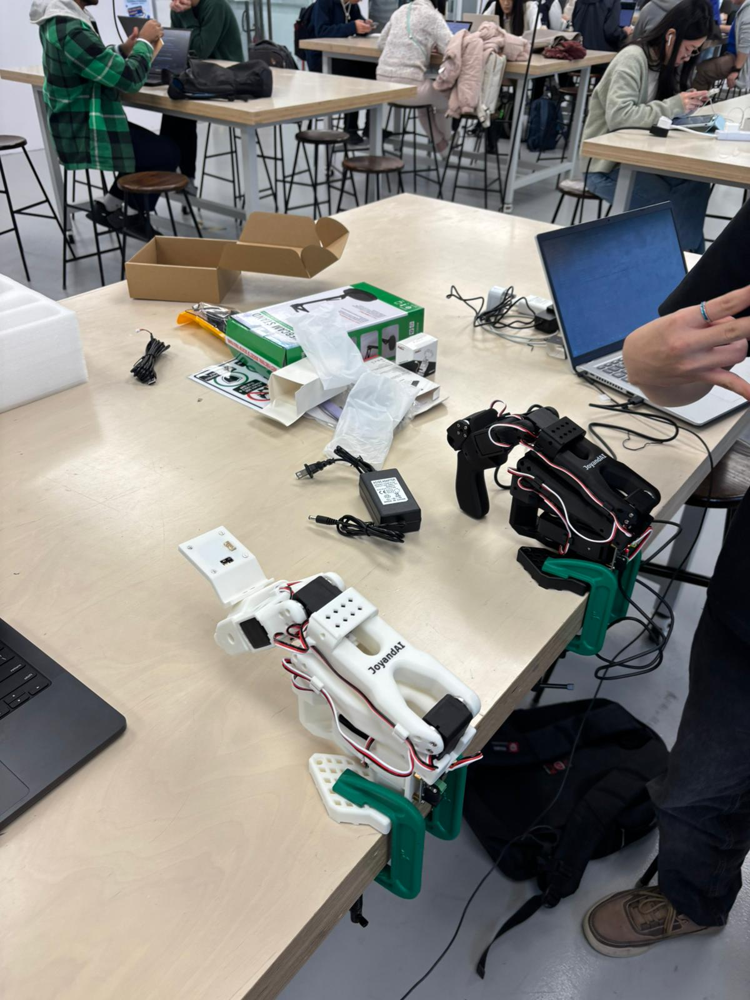
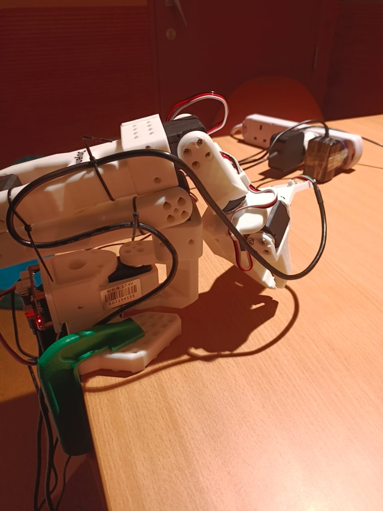
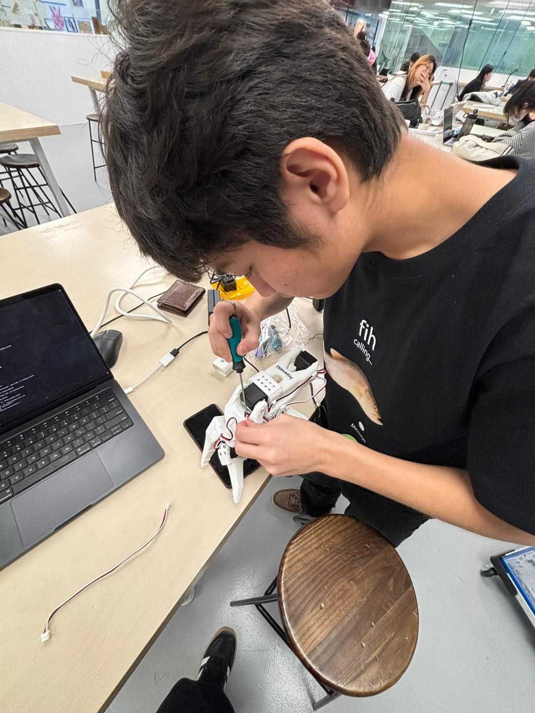
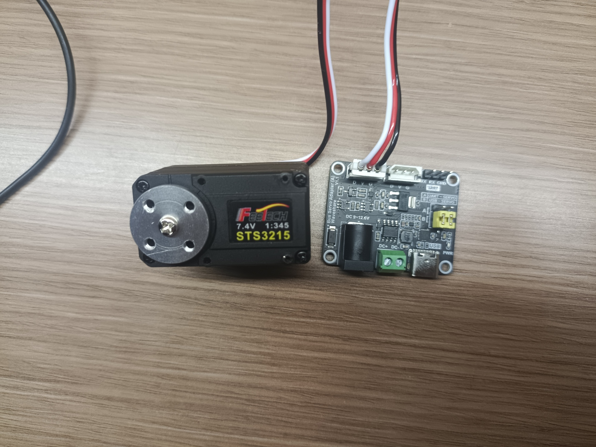
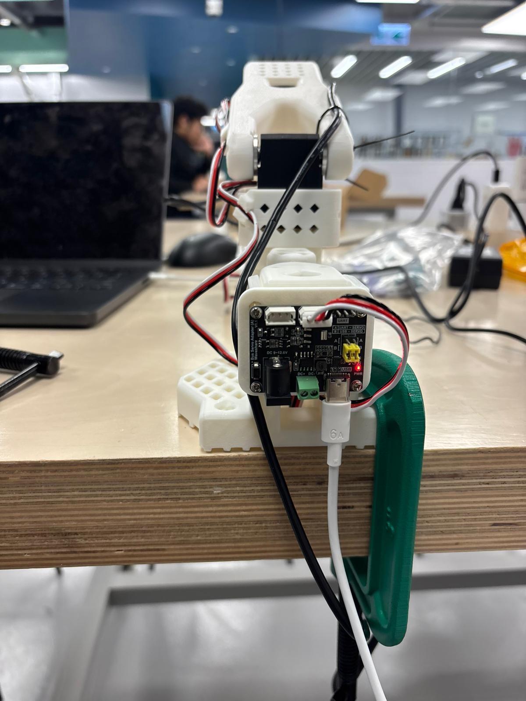
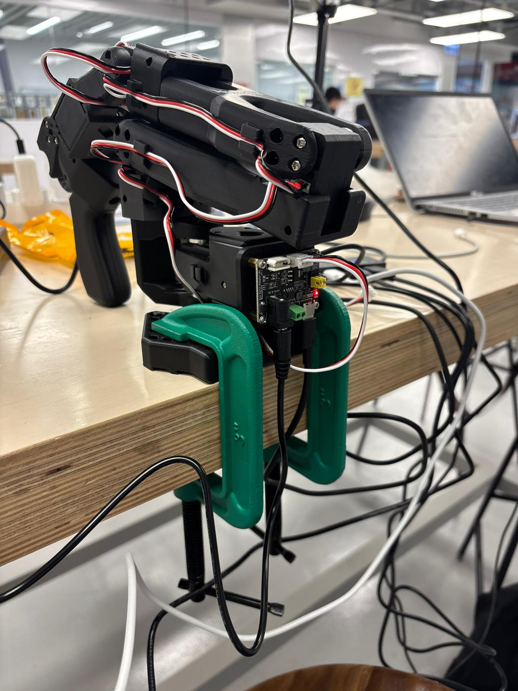

# LeRobot SO101 Teleoperation (Bus Servo / Dynamixel-style)
<p align="center">
  
</p>

## Teleoperation + safety + logging + replay for a 6-DOF LeRobot SO101 setup using daisy-chained smart servos on a single TTL bus.
<p align="center">
  
  
  
</p>

## Hardware topology
<p align="center">
  
</p>
Laptop → USB → USB↔TTL adapter board → Servo bus → (Motor 1 → Motor 2 → … → Motor 6)

## Leader and Follower Arms
<p align="center">
  
  
</p>
  
## Features
- ✅ Keyboard teleoperation
- ✅ Safety clamps using real joint ranges (`range_min/range_max`) from `Group_Follower.json`
- ✅ CSV logging
- ✅ Replay from logs
- ✅ Scan tool to verify IDs

## Setup (Windows)
```bash
python -m venv .venv
.venv\Scripts\activate
pip install -r requirements.txt
